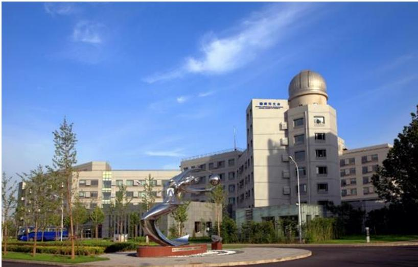

中国科学院国家天文合

NATIONALASTRONOMICAL OBSERVATORIES,CAS

## 中国科学院国家天文台2023年部门预算

## 目 录

一、中国科学院国家天文台基本情况.  
（一）单位职责  
（二）机构设置.  
二、中国科学院国家天文台2023年部门预算.  
收支总表.  
关于收支总表的说明，  
收入总表..  
关于收入总表的说明，  
支出总表. 8  
关于支出总表的说明， 9  
财政拨款收支总表， 10  
关于财政拨款收支总表的说明， 11  
一般公共预算支出表. 12  
关于一般公共预算支出表的说明. 13  
一般公共预算基本支出表. 14  
关于一般公共预算基本支出表的说明.. 16  
一般公共预算“三公"经费支出表. 17  
关于一般公共预算“三公"经费支出表的说明. .18  
政府性基金收支表， .19  
国有资本经营预算支出表. .20  
三、其他事项说明. 21  
（一）政府采购情况说明 .21  
（二）国有资产占有使用情况说明 21  
（三）预算绩效情况说明， .21  
四、名词解释.. 22  
（一）收入科目 22  
（二）支出科目 .22  
附表：中国科学院国家天文台项目预算绩交效目标表..25

## 一、中国科学院国家天文台基本情况

## （一）单位职责

中国科学院国家天文台是中国科学院直属事业单位，成立于 2001年4月，系由中国科学院天文领域原两台一所两站整合而成。

中国科学院国家天文台发展目标是：建设成为集天文学基础前沿研究、天文技术方法创新应用、地基与空间重大天文观测装置建造运行、国家月球与深空探测科学应用和空间碎片监测与应用等“四位一体"的、世界一流水平的综合性国家天文研究机构，引领中国天文事业实现新的跨越，为加快实现国家高水平科技自立自强做出应有贡献，为人类探索宇宙奥秘做出中国贡献。

中国科学院国家天文台新时期办台方针是：以“出重大成果、出优秀人才"为中心，规划好、建设好、运行好、使用好重大观测装置和重大任务设施，积极承担并圆满完成相关领域国家重大科技任务，不断推动天文领域重大原创成果产出、关键核心技术突破、天文学人才高地建设和科技体制机制改革。

## （二）机构设置

中国科学院国家天文台是国家航天局空间碎片监测与应用中心、国家天文科学数据中心的依托单位，国际空间环境服务组织中国中心主任单位；是中国科学院天文大科学研究中心、南美天文研究中心的依托单位；是中国科学院大学天文与空间科学学院主承办单位。

中国科学院国家天文台本部内设有光学天文、射电天文、星系宇宙学、太阳物理、空间科学、月球与深空探测、应用天文等7个研究部，8个管理部门和2个支撑部门。在河北兴隆，北京怀柔、密云，天津武清，新疆乌拉斯台、红柳峡、慕士塔格，西藏阿里、羊八井，青海冷湖，贵州平塘以及阿根廷圣胡安等地建有天文观测基地或台站。

## 二、中国科学院国家天文台2023年部门预算

2023 年是深入推进实施“十四五"战略规划、推动“十四五"规划目标实现的关键之年，抢抓机遇争取承担国家重大科技任务，管理运行好重大观测设施，组织做好各类科学数据处理的应用研究工作，努力产出更多更大科学成果。

2023 年工作总体思路是：深入学习贯彻党的二十大精神，落实党的全面领导，落实党中央、国务院和院党组重大决策部署，面向国家重大需求、面向国际天文科技前沿、面向经济主战场，加快推进国家“十四五"科技发展规划实施，加快建设和持续推进国家重点实验室重组工作，加快协同凝聚天文领域科研队伍，加强青年人才队伍建设，加快进入高质量发展新阶段，为创新型国家和世界科技强国建设做出更大贡献。

中国科学院国家天文台2023年初部门预算总额198,223.16万元。中国科学院国家天文台部门预算既包括人员支出和机构运行支出，也包括竞争性经费、人才引进与培养、科研条件及后勤保障、合作交流与咨询传播、科普活动、科研设施专项运行等支出。

## 收支总表

部门公开表1

单位：万元

<table><tr><td rowspan=1 colspan=2>收入</td><td rowspan=1 colspan=2>支     出</td></tr><tr><td rowspan=1 colspan=1>项目</td><td rowspan=1 colspan=1>预算数</td><td rowspan=1 colspan=1>项目</td><td rowspan=1 colspan=1>预算数</td></tr><tr><td rowspan=1 colspan=1>一、一般公共预算拨款收入</td><td rowspan=1 colspan=1>57,806.77</td><td rowspan=1 colspan=1>一、科学技术支出</td><td rowspan=1 colspan=1>143,981.03</td></tr><tr><td rowspan=1 colspan=1>二、政府性基金预算拨款收入</td><td rowspan=1 colspan=1></td><td rowspan=1 colspan=1>二、社会保障和就业支出</td><td rowspan=1 colspan=1>1,930.68</td></tr><tr><td rowspan=1 colspan=1>三、国有资本经营预算拨款</td><td rowspan=1 colspan=1></td><td rowspan=1 colspan=1>三、住房保障支出</td><td rowspan=1 colspan=1>1,314.37</td></tr><tr><td rowspan=1 colspan=1>四、事业收入</td><td rowspan=1 colspan=1>32,.000.00</td><td rowspan=1 colspan=1></td><td rowspan=1 colspan=1></td></tr><tr><td rowspan=1 colspan=1>五、事业单位经营收入</td><td rowspan=1 colspan=1></td><td rowspan=1 colspan=1></td><td rowspan=1 colspan=1></td></tr><tr><td rowspan=1 colspan=1>六、其他收入</td><td rowspan=1 colspan=1>2,200.00</td><td rowspan=1 colspan=1></td><td rowspan=1 colspan=1></td></tr><tr><td rowspan=1 colspan=1></td><td rowspan=1 colspan=1></td><td rowspan=1 colspan=1></td><td rowspan=1 colspan=1></td></tr><tr><td rowspan=1 colspan=1>本年收入合计</td><td rowspan=1 colspan=1>92,006.77</td><td rowspan=1 colspan=1>本年支出合计</td><td rowspan=1 colspan=1>147,226.08</td></tr><tr><td rowspan=1 colspan=1>使用非财政拨款结余</td><td rowspan=1 colspan=1></td><td rowspan=1 colspan=1>结转下年</td><td rowspan=1 colspan=1>50,997.08</td></tr><tr><td rowspan=1 colspan=1>上年结转</td><td rowspan=1 colspan=1>106,216.39</td><td rowspan=1 colspan=1></td><td rowspan=1 colspan=1></td></tr><tr><td rowspan=1 colspan=1>收入总计</td><td rowspan=1 colspan=1>198,223.16</td><td rowspan=1 colspan=1>支出总计</td><td rowspan=1 colspan=1>198,223.16</td></tr></table>

## 关于收支总表的说明

按照部门预算编制要求，单位所有收入和支出均纳入部门预算管理。收入包括：一般公共预算拨款收入、事业收入、其他收入、上年结转。支出包括：科学技术支出、社会保障和就业支出、住房保障支出。我单位2023年收支总预算198,223.16万元。

## 收入总表

部门公开表2

单位：万元

<table><tr><td rowspan=2 colspan=1>合计</td><td rowspan=2 colspan=1>上年结转</td><td rowspan=2 colspan=1>一般公共预算拨款收入</td><td rowspan=2 colspan=1>政府性基金预算拨款收入</td><td rowspan=2 colspan=1>国有资本经营预算拨款收入</td><td rowspan=1 colspan=2>事业收入</td><td rowspan=2 colspan=1>事业单位经营收入</td><td rowspan=2 colspan=1>上级补助收入</td><td rowspan=2 colspan=1>附属单位上缴收入</td><td rowspan=2 colspan=1>其他收入</td><td rowspan=2 colspan=1>使用非财政拨款结余</td></tr><tr><td rowspan=1 colspan=1>金额</td><td rowspan=1 colspan=1>其中：教育收费</td></tr><tr><td rowspan=1 colspan=1>198,223.16</td><td rowspan=1 colspan=1>106,216.39</td><td rowspan=1 colspan=1>57,806.77</td><td rowspan=1 colspan=1></td><td rowspan=1 colspan=1></td><td rowspan=1 colspan=1>32.000.00</td><td rowspan=1 colspan=1></td><td rowspan=1 colspan=1></td><td rowspan=1 colspan=1></td><td rowspan=1 colspan=1></td><td rowspan=1 colspan=1>2,200.00</td><td rowspan=1 colspan=1></td></tr></table>

## 关于收入总表的说明

2023 年初，我单位收入总计198,223.16万元。其中，一般公共预算拨款收入57,806.77万元，占 29.16%；事业收入32,000.00万元，占16.14%;其他收入2,200.00万元，占1.11%;上年结转106,216.39万元，占53.59%。

## 支出总表

部门公开表3

单位：万元

<table><tr><td rowspan=1 colspan=1>科目编码</td><td rowspan=1 colspan=1>科目名称</td><td rowspan=1 colspan=1>合计</td><td rowspan=1 colspan=1>基本支出</td><td rowspan=1 colspan=1>项目支出</td></tr><tr><td rowspan=1 colspan=1>206</td><td rowspan=1 colspan=1>科学技术支出</td><td rowspan=1 colspan=1>143,981.03</td><td rowspan=1 colspan=1>16,362.47</td><td rowspan=1 colspan=1>127,618.56</td></tr><tr><td rowspan=1 colspan=1>20602</td><td rowspan=1 colspan=1>基础研究</td><td rowspan=1 colspan=1>100,542.25</td><td rowspan=1 colspan=1>16,362.47</td><td rowspan=1 colspan=1>84,179.78</td></tr><tr><td rowspan=1 colspan=1>2060201</td><td rowspan=1 colspan=1>机构运行</td><td rowspan=1 colspan=1>16,362.47</td><td rowspan=1 colspan=1>16,362.47</td><td rowspan=1 colspan=1>-</td></tr><tr><td rowspan=1 colspan=1>2060203</td><td rowspan=1 colspan=1>自然科学基金</td><td rowspan=1 colspan=1>6.000.00</td><td rowspan=1 colspan=1></td><td rowspan=1 colspan=1>6.000.00</td></tr><tr><td rowspan=1 colspan=1>2060205</td><td rowspan=1 colspan=1>重大科学工程</td><td rowspan=1 colspan=1>16,158.00</td><td rowspan=1 colspan=1>-</td><td rowspan=1 colspan=1>16,158.00</td></tr><tr><td rowspan=1 colspan=1>2060206</td><td rowspan=1 colspan=1>专项基础科研</td><td rowspan=1 colspan=1>14,359.75</td><td rowspan=1 colspan=1>-</td><td rowspan=1 colspan=1>14,359.75</td></tr><tr><td rowspan=1 colspan=1>2060299</td><td rowspan=1 colspan=1>其他基础研究支出</td><td rowspan=1 colspan=1>47,662.03</td><td rowspan=1 colspan=1>-</td><td rowspan=1 colspan=1>47,662.03</td></tr><tr><td rowspan=1 colspan=1>20603</td><td rowspan=1 colspan=1>应用研究</td><td rowspan=1 colspan=1>19.053.95</td><td rowspan=1 colspan=1></td><td rowspan=1 colspan=1>19,053.95</td></tr><tr><td rowspan=1 colspan=1>20605</td><td rowspan=1 colspan=1>科技条件与服务</td><td rowspan=1 colspan=1>5,728.68</td><td rowspan=1 colspan=1>-</td><td rowspan=1 colspan=1>5,728.68</td></tr><tr><td rowspan=1 colspan=1>2060503</td><td rowspan=1 colspan=1>科技条件专项</td><td rowspan=1 colspan=1>5,728.68</td><td rowspan=1 colspan=1>1</td><td rowspan=1 colspan=1>5,728.68</td></tr><tr><td rowspan=1 colspan=1>20608</td><td rowspan=1 colspan=1>科技交流与合作</td><td rowspan=1 colspan=1>1,977.14</td><td rowspan=1 colspan=1></td><td rowspan=1 colspan=1>1,977.14</td></tr><tr><td rowspan=1 colspan=1>2060801</td><td rowspan=1 colspan=1>国际交流与合作</td><td rowspan=1 colspan=1>1,977.14</td><td rowspan=1 colspan=1>1</td><td rowspan=1 colspan=1>1,977.14</td></tr><tr><td rowspan=1 colspan=1>20609</td><td rowspan=1 colspan=1>科技重大专项</td><td rowspan=1 colspan=1>16,679.01</td><td rowspan=1 colspan=1></td><td rowspan=1 colspan=1>16,679.01</td></tr><tr><td rowspan=1 colspan=1>208</td><td rowspan=1 colspan=1>社会保障和就业支出</td><td rowspan=1 colspan=1>1,930.68</td><td rowspan=1 colspan=1>1,930.68</td><td rowspan=1 colspan=1>-</td></tr><tr><td rowspan=1 colspan=1>20805</td><td rowspan=1 colspan=1>行政事业单位养老支出</td><td rowspan=1 colspan=1>1,930.68</td><td rowspan=1 colspan=1>1,930.68</td><td rowspan=1 colspan=1></td></tr><tr><td rowspan=1 colspan=1>2080505</td><td rowspan=1 colspan=1>机关事业单位基本养老保险缴费支出</td><td rowspan=1 colspan=1>1,287.12</td><td rowspan=1 colspan=1>1,287.12</td><td rowspan=1 colspan=1></td></tr><tr><td rowspan=1 colspan=1>2080506</td><td rowspan=1 colspan=1>机关事业单位职业年金缴费支出</td><td rowspan=1 colspan=1>643.56</td><td rowspan=1 colspan=1>643.56</td><td rowspan=1 colspan=1>1</td></tr><tr><td rowspan=1 colspan=1>221</td><td rowspan=1 colspan=1>住房保障支出</td><td rowspan=1 colspan=1>1,314.37</td><td rowspan=1 colspan=1>1,314.37</td><td rowspan=1 colspan=1></td></tr><tr><td rowspan=1 colspan=1>22102</td><td rowspan=1 colspan=1>住房改革支出</td><td rowspan=1 colspan=1>1,314.37</td><td rowspan=1 colspan=1>1,314.37</td><td rowspan=1 colspan=1>=</td></tr><tr><td rowspan=1 colspan=1>2210201</td><td rowspan=1 colspan=1>住房公积金</td><td rowspan=1 colspan=1>707.85</td><td rowspan=1 colspan=1>707.85</td><td rowspan=1 colspan=1></td></tr><tr><td rowspan=1 colspan=1>2210202</td><td rowspan=1 colspan=1>提租补贴</td><td rowspan=1 colspan=1>92.45</td><td rowspan=1 colspan=1>92.45</td><td rowspan=1 colspan=1>-</td></tr><tr><td rowspan=1 colspan=1>2210203</td><td rowspan=1 colspan=1>购房补贴</td><td rowspan=1 colspan=1>514.07</td><td rowspan=1 colspan=1>514.07</td><td rowspan=1 colspan=1></td></tr><tr><td rowspan=1 colspan=2>合计</td><td rowspan=1 colspan=1>147,226.08</td><td rowspan=1 colspan=1>19,607.52</td><td rowspan=1 colspan=1>127,618.56</td></tr></table>

## 关于支出总表的说明

2023 年初，我单位支出总计147,226.08万元。其中，基本支出19,607.52万元，占13.32%；项目支出127,618.56万元，占86.68%。

## 财政拨款收支总表

部门公开表4

单位：万元

<table><tr><td rowspan=1 colspan=2>收入</td><td rowspan=1 colspan=2>支     出</td></tr><tr><td rowspan=1 colspan=1>项目</td><td rowspan=1 colspan=1>预算数</td><td rowspan=1 colspan=1>项目</td><td rowspan=1 colspan=1>预算数</td></tr><tr><td rowspan=1 colspan=1>一、本年收入</td><td rowspan=1 colspan=1>57,806.77</td><td rowspan=1 colspan=1>一、本年支出</td><td rowspan=1 colspan=1>121,226.08</td></tr><tr><td rowspan=1 colspan=1>(一)一般公共预算财政拨款</td><td rowspan=1 colspan=1>57,806.77</td><td rowspan=1 colspan=1>（一）科学技术支出</td><td rowspan=1 colspan=1>117,981.03</td></tr><tr><td rowspan=1 colspan=1>(二)政府性基金预算财政拨款</td><td rowspan=1 colspan=1></td><td rowspan=1 colspan=1>（二）社会保障和就业支出</td><td rowspan=1 colspan=1>1,930.68</td></tr><tr><td rowspan=1 colspan=1>(三)国有资本经营预算拨款</td><td rowspan=1 colspan=1></td><td rowspan=1 colspan=1>(三）住房保障支出</td><td rowspan=1 colspan=1>1,314.37</td></tr><tr><td rowspan=1 colspan=1></td><td rowspan=1 colspan=1></td><td rowspan=1 colspan=1></td><td rowspan=1 colspan=1></td></tr><tr><td rowspan=1 colspan=1>二、上年结转</td><td rowspan=1 colspan=1>63,419.31</td><td rowspan=1 colspan=1>二、结转下年</td><td rowspan=1 colspan=1></td></tr><tr><td rowspan=1 colspan=1>(一)一般公共预算财政拨款</td><td rowspan=1 colspan=1>63,419.31</td><td rowspan=1 colspan=1></td><td rowspan=1 colspan=1></td></tr><tr><td rowspan=1 colspan=1>(二)政府性基金预算财政拨款</td><td rowspan=1 colspan=1></td><td rowspan=1 colspan=1></td><td rowspan=1 colspan=1></td></tr><tr><td rowspan=1 colspan=1>(三)国有资本经营预算拨款</td><td rowspan=1 colspan=1></td><td rowspan=1 colspan=1></td><td rowspan=1 colspan=1></td></tr><tr><td rowspan=1 colspan=1>收入总计</td><td rowspan=1 colspan=1>121,226.08</td><td rowspan=1 colspan=1>支出总计</td><td rowspan=1 colspan=1>121,226.08</td></tr></table>

## 关于财政拨款收支总表的说明

## （一）收入预算

2023 年初，一般公共预算拨款收入预算数为 57,806.77万元；上年结转63,419.31万元。

## （二）支出预算

2023 年初，科学技术支出预算数为117,981.03万元；社会保障和就业支出预算数为1,930.68万元；住房保障支出预算数为1,314.37万元。

## 一般公共预算支出表

部门公开表5

单位：万元

<table><tr><td rowspan=2 colspan=1>科目编码</td><td rowspan=2 colspan=1>科目名称</td><td rowspan=1 colspan=3>本年一般公共预算支出</td></tr><tr><td rowspan=1 colspan=1>合计</td><td rowspan=1 colspan=1>基本支出</td><td rowspan=1 colspan=1>项目支出</td></tr><tr><td rowspan=1 colspan=1>206</td><td rowspan=1 colspan=1>科学技术支出</td><td rowspan=1 colspan=1>54,561.72</td><td rowspan=1 colspan=1>10,362.47</td><td rowspan=1 colspan=1>44,199.25</td></tr><tr><td rowspan=1 colspan=1>20602</td><td rowspan=1 colspan=1>基础研究</td><td rowspan=1 colspan=1>45,158.07</td><td rowspan=1 colspan=1>10,362.47</td><td rowspan=1 colspan=1>34,795.60</td></tr><tr><td rowspan=1 colspan=1>2060201</td><td rowspan=1 colspan=1>机构运行</td><td rowspan=1 colspan=1>10,362.47</td><td rowspan=1 colspan=1>10,362.47</td><td rowspan=1 colspan=1></td></tr><tr><td rowspan=1 colspan=1>2060205</td><td rowspan=1 colspan=1>重大科学工程</td><td rowspan=1 colspan=1>16,158.00</td><td rowspan=1 colspan=1></td><td rowspan=1 colspan=1>16,158.00</td></tr><tr><td rowspan=1 colspan=1>2060206</td><td rowspan=1 colspan=1>专项基础科研</td><td rowspan=1 colspan=1>3,765.48</td><td rowspan=1 colspan=1></td><td rowspan=1 colspan=1>3,765.48</td></tr><tr><td rowspan=1 colspan=1>2060299</td><td rowspan=1 colspan=1>其他基础研究支出</td><td rowspan=1 colspan=1>14,872.12</td><td rowspan=1 colspan=1></td><td rowspan=1 colspan=1>14,872.12</td></tr><tr><td rowspan=1 colspan=1>20603</td><td rowspan=1 colspan=1>应用研究</td><td rowspan=1 colspan=1>640.00</td><td rowspan=1 colspan=1></td><td rowspan=1 colspan=1>640.00</td></tr><tr><td rowspan=1 colspan=1>20605</td><td rowspan=1 colspan=1>科技条件与服务</td><td rowspan=1 colspan=1>3,686.51</td><td rowspan=1 colspan=1></td><td rowspan=1 colspan=1>3,686.51</td></tr><tr><td rowspan=1 colspan=1>2060503</td><td rowspan=1 colspan=1>科技条件专项</td><td rowspan=1 colspan=1>3,686.51</td><td rowspan=1 colspan=1>-</td><td rowspan=1 colspan=1>3,686.51</td></tr><tr><td rowspan=1 colspan=1>20608</td><td rowspan=1 colspan=1>科技交流与合作</td><td rowspan=1 colspan=1>1,977.14</td><td rowspan=1 colspan=1></td><td rowspan=1 colspan=1>1,977.14</td></tr><tr><td rowspan=1 colspan=1>2060801</td><td rowspan=1 colspan=1>国际交流与合作</td><td rowspan=1 colspan=1>1,977.14</td><td rowspan=1 colspan=1></td><td rowspan=1 colspan=1>1,977.14</td></tr><tr><td rowspan=1 colspan=1>20609</td><td rowspan=1 colspan=1>科技重大专项</td><td rowspan=1 colspan=1>3,100.00</td><td rowspan=1 colspan=1></td><td rowspan=1 colspan=1>3,100.00</td></tr><tr><td rowspan=1 colspan=1>208</td><td rowspan=1 colspan=1>社会保障和就业支出</td><td rowspan=1 colspan=1>1,930.68</td><td rowspan=1 colspan=1>1,930.68</td><td rowspan=1 colspan=1></td></tr><tr><td rowspan=1 colspan=1>20805</td><td rowspan=1 colspan=1>行政事业单位养老支出</td><td rowspan=1 colspan=1>1,930.68</td><td rowspan=1 colspan=1>1,930.68</td><td rowspan=1 colspan=1></td></tr><tr><td rowspan=1 colspan=1>2080505</td><td rowspan=1 colspan=1>机关事业单位基本养老保险缴费支出</td><td rowspan=1 colspan=1>1,287.12</td><td rowspan=1 colspan=1>1,287.12</td><td rowspan=1 colspan=1></td></tr><tr><td rowspan=1 colspan=1>2080506</td><td rowspan=1 colspan=1>机关事业单位职业年金缴费支出</td><td rowspan=1 colspan=1>643.56</td><td rowspan=1 colspan=1>643.56</td><td rowspan=1 colspan=1></td></tr><tr><td rowspan=1 colspan=1>221</td><td rowspan=1 colspan=1>住房保障支出</td><td rowspan=1 colspan=1>1,314.37</td><td rowspan=1 colspan=1>1,314.37</td><td rowspan=1 colspan=1></td></tr><tr><td rowspan=1 colspan=1>22102</td><td rowspan=1 colspan=1>住房改革支出</td><td rowspan=1 colspan=1>1,314.37</td><td rowspan=1 colspan=1>1,314.37</td><td rowspan=1 colspan=1></td></tr><tr><td rowspan=1 colspan=1>2210201</td><td rowspan=1 colspan=1>住房公积金</td><td rowspan=1 colspan=1>707.85</td><td rowspan=1 colspan=1>707.85</td><td rowspan=1 colspan=1></td></tr><tr><td rowspan=1 colspan=1>2210202</td><td rowspan=1 colspan=1>提租补贴</td><td rowspan=1 colspan=1>92.45</td><td rowspan=1 colspan=1>92.45</td><td rowspan=1 colspan=1></td></tr><tr><td rowspan=1 colspan=1>2210203</td><td rowspan=1 colspan=1>购房补贴</td><td rowspan=1 colspan=1>514.07</td><td rowspan=1 colspan=1>514.07</td><td rowspan=1 colspan=1></td></tr><tr><td rowspan=1 colspan=2>合计</td><td rowspan=1 colspan=1>57,806.77</td><td rowspan=1 colspan=1>13,607.52</td><td rowspan=1 colspan=1> 44,199.25</td></tr></table>

## 关于一般公共预算支出表的说明

2023年，按照党中央、国务院过“紧日子"要求，厉行节约办一切事业，压减一般性、非刚性支出，重点压减了公用经费支出，合理保障了重大支出需求。2023年初，我单位一般公共预算支出 57,806.77 万元，其中：基本支出 13,607.52万元，占23.54%；项目支出 44,199.25万元，占76.46%。

## 一般公共预算基本支出表

部门公开表6

单位：万元

<table><tr><td colspan="3" rowspan="1">人员经费</td><td colspan="6" rowspan="1">公用经费</td></tr><tr><td colspan="1" rowspan="1">科目编码</td><td colspan="1" rowspan="1">科目名称</td><td colspan="1" rowspan="1">预算数</td><td colspan="1" rowspan="1">科目编码</td><td colspan="1" rowspan="1">科目名称</td><td colspan="1" rowspan="1">日常公用经费</td><td colspan="1" rowspan="1">科目编码</td><td colspan="1" rowspan="1">科目名称</td><td colspan="1" rowspan="1">日常公用经费</td></tr><tr><td colspan="1" rowspan="1">301</td><td colspan="1" rowspan="1">工资福利支出</td><td colspan="1" rowspan="1">11,398.40</td><td colspan="1" rowspan="1">302</td><td colspan="1" rowspan="1">商品和服务支出</td><td colspan="1" rowspan="1">1,424.12</td><td colspan="1" rowspan="1">310</td><td colspan="1" rowspan="1">资本性支出</td><td colspan="1" rowspan="1">125.00</td></tr><tr><td colspan="1" rowspan="1">30101</td><td colspan="1" rowspan="1">基本工资</td><td colspan="1" rowspan="1">2.310.00</td><td colspan="1" rowspan="1">30201</td><td colspan="1" rowspan="1">办公费</td><td colspan="1" rowspan="1">10.00</td><td colspan="1" rowspan="1">31002</td><td colspan="1" rowspan="1">办公设备购置</td><td colspan="1" rowspan="1">55.00</td></tr><tr><td colspan="1" rowspan="1">30102</td><td colspan="1" rowspan="1">津贴补贴</td><td colspan="1" rowspan="1">1,859.87</td><td colspan="1" rowspan="1">30202</td><td colspan="1" rowspan="1">印刷费</td><td colspan="1" rowspan="1">2.00</td><td colspan="1" rowspan="1">31099</td><td colspan="1" rowspan="1">其他资本性支出</td><td colspan="1" rowspan="1">70.00</td></tr><tr><td colspan="1" rowspan="1">30106</td><td colspan="1" rowspan="1">伙食补助费</td><td colspan="1" rowspan="1">120.00</td><td colspan="1" rowspan="1">30203</td><td colspan="1" rowspan="1">咨询费</td><td colspan="1" rowspan="1">8.00</td><td colspan="1" rowspan="1"></td><td colspan="1" rowspan="1"></td><td colspan="1" rowspan="1"></td></tr><tr><td colspan="1" rowspan="1">30107</td><td colspan="1" rowspan="1">绩效工资</td><td colspan="1" rowspan="1">1,800.00</td><td colspan="1" rowspan="1">30204</td><td colspan="1" rowspan="1">手续费</td><td colspan="1" rowspan="1">6.00</td><td colspan="1" rowspan="1"></td><td colspan="1" rowspan="1"></td><td colspan="1" rowspan="1"></td></tr><tr><td colspan="1" rowspan="1">30108</td><td colspan="1" rowspan="1">机关事业单位基本养老保险缴费</td><td colspan="1" rowspan="1">1,364.12</td><td colspan="1" rowspan="1">30205</td><td colspan="1" rowspan="1">水费</td><td colspan="1" rowspan="1">9.00</td><td colspan="1" rowspan="1"></td><td colspan="1" rowspan="1"></td><td colspan="1" rowspan="1"></td></tr><tr><td colspan="1" rowspan="1">30109</td><td colspan="1" rowspan="1">职业年金缴费</td><td colspan="1" rowspan="1">566.56</td><td colspan="1" rowspan="1">30206</td><td colspan="1" rowspan="1">电费</td><td colspan="1" rowspan="1">200.00</td><td colspan="1" rowspan="1"></td><td colspan="1" rowspan="1"></td><td colspan="1" rowspan="1"></td></tr><tr><td colspan="1" rowspan="1">30110</td><td colspan="1" rowspan="1">职工基本医疗保险缴费</td><td colspan="1" rowspan="1">180.00</td><td colspan="1" rowspan="1">30207</td><td colspan="1" rowspan="1">邮电费</td><td colspan="1" rowspan="1">18.00</td><td colspan="1" rowspan="1"></td><td colspan="1" rowspan="1"></td><td colspan="1" rowspan="1"></td></tr><tr><td colspan="1" rowspan="1">30112</td><td colspan="1" rowspan="1">其他社会保障缴费</td><td colspan="1" rowspan="1">270.00</td><td colspan="1" rowspan="1">30208</td><td colspan="1" rowspan="1">取暖费</td><td colspan="1" rowspan="1">28.00</td><td colspan="1" rowspan="1"></td><td colspan="1" rowspan="1"></td><td colspan="1" rowspan="1"></td></tr><tr><td colspan="1" rowspan="1">30113</td><td colspan="1" rowspan="1">住房公积金</td><td colspan="1" rowspan="1">1,407.85</td><td colspan="1" rowspan="1">30209</td><td colspan="1" rowspan="1">物业管理费</td><td colspan="1" rowspan="1">346.00</td><td colspan="1" rowspan="1"></td><td colspan="1" rowspan="1"></td><td colspan="1" rowspan="1"></td></tr><tr><td colspan="1" rowspan="1">30114</td><td colspan="1" rowspan="1">医疗费</td><td colspan="1" rowspan="1">530.00</td><td colspan="1" rowspan="1">30211</td><td colspan="1" rowspan="1">差旅费</td><td colspan="1" rowspan="1">30.00</td><td colspan="1" rowspan="1"></td><td colspan="1" rowspan="1"></td><td colspan="1" rowspan="1"></td></tr><tr><td colspan="1" rowspan="1">30199</td><td colspan="1" rowspan="1">其他工资福利支出</td><td colspan="1" rowspan="1">990.00</td><td colspan="1" rowspan="1">30213</td><td colspan="1" rowspan="1">维修(护)费</td><td colspan="1" rowspan="1">60.00</td><td colspan="1" rowspan="1"></td><td colspan="1" rowspan="1"></td><td colspan="1" rowspan="1"></td></tr><tr><td colspan="1" rowspan="1">303</td><td colspan="1" rowspan="1">对个人和家庭的补助</td><td colspan="1" rowspan="1">660.00</td><td colspan="1" rowspan="1">30214</td><td colspan="1" rowspan="1">租赁费</td><td colspan="1" rowspan="1">5.00</td><td colspan="1" rowspan="1"></td><td colspan="1" rowspan="1"></td><td colspan="1" rowspan="1"></td></tr><tr><td colspan="1" rowspan="1">30301</td><td colspan="1" rowspan="1">离休费</td><td colspan="1" rowspan="1">120.00</td><td colspan="1" rowspan="1">30215</td><td colspan="1" rowspan="1">会议费</td><td colspan="1" rowspan="1">13.00</td><td colspan="1" rowspan="1"></td><td colspan="1" rowspan="1"></td><td colspan="1" rowspan="1"></td></tr><tr><td colspan="1" rowspan="1">30302</td><td colspan="1" rowspan="1">退休费</td><td colspan="1" rowspan="1">142.00</td><td colspan="1" rowspan="1">30216</td><td colspan="1" rowspan="1">培训费</td><td colspan="1" rowspan="1">10.00</td><td colspan="1" rowspan="1"></td><td colspan="1" rowspan="1"></td><td colspan="1" rowspan="1"></td></tr><tr><td colspan="1" rowspan="1">30304</td><td colspan="1" rowspan="1">抚恤金</td><td colspan="1" rowspan="1">240.00</td><td colspan="1" rowspan="1">30218</td><td colspan="1" rowspan="1">专用材料费</td><td colspan="1" rowspan="1">10.00</td><td colspan="1" rowspan="1"></td><td colspan="1" rowspan="1"></td><td colspan="1" rowspan="1"></td></tr><tr><td colspan="1" rowspan="1">30305</td><td colspan="1" rowspan="1">生活补助</td><td colspan="1" rowspan="1">3.00</td><td colspan="1" rowspan="1">30226</td><td colspan="1" rowspan="1">劳务费</td><td colspan="1" rowspan="1">50.00</td><td colspan="1" rowspan="1"></td><td colspan="1" rowspan="1"></td><td colspan="1" rowspan="1"></td></tr><tr><td colspan="1" rowspan="1">30308</td><td colspan="1" rowspan="1">助学金</td><td colspan="1" rowspan="1">5.00</td><td colspan="1" rowspan="1">30227</td><td colspan="1" rowspan="1">委托业务费</td><td colspan="1" rowspan="1">20.00</td><td colspan="1" rowspan="1"></td><td colspan="1" rowspan="1"></td><td colspan="1" rowspan="1"></td></tr><tr><td colspan="1" rowspan="1">30309</td><td colspan="1" rowspan="1">奖励金</td><td colspan="1" rowspan="1">20.00</td><td colspan="1" rowspan="1">30228</td><td colspan="1" rowspan="1">工会经费</td><td colspan="1" rowspan="1">247.99</td><td colspan="1" rowspan="1"></td><td colspan="1" rowspan="1"></td><td colspan="1" rowspan="1"></td></tr><tr><td colspan="1" rowspan="1">30399</td><td colspan="1" rowspan="1">其他对个人和家庭的补助</td><td colspan="1" rowspan="1">130.00</td><td colspan="1" rowspan="1">30231</td><td colspan="1" rowspan="1">公务用车运行维护费</td><td colspan="1" rowspan="1">57.13</td><td colspan="1" rowspan="1"></td><td colspan="1" rowspan="1"></td><td colspan="1" rowspan="1"></td></tr><tr><td colspan="1" rowspan="1"></td><td colspan="1" rowspan="1"></td><td colspan="1" rowspan="1"></td><td colspan="1" rowspan="1">30239</td><td colspan="1" rowspan="1">其他交通费用</td><td colspan="1" rowspan="1">20.00</td><td colspan="1" rowspan="1"></td><td colspan="1" rowspan="1"></td><td colspan="1" rowspan="1"></td></tr><tr><td colspan="1" rowspan="1"></td><td colspan="1" rowspan="1"></td><td colspan="1" rowspan="1"></td><td colspan="1" rowspan="1">30240</td><td colspan="1" rowspan="1">税金及附加费用</td><td colspan="1" rowspan="1">10.00</td><td colspan="1" rowspan="1"></td><td colspan="1" rowspan="1"></td><td colspan="1" rowspan="1"></td></tr><tr><td colspan="1" rowspan="1"></td><td colspan="1" rowspan="1"></td><td colspan="1" rowspan="1"></td><td colspan="1" rowspan="1">30299</td><td colspan="1" rowspan="1">其他商品和服务支出</td><td colspan="1" rowspan="1">264.00</td><td colspan="1" rowspan="1"></td><td colspan="1" rowspan="1"></td><td colspan="1" rowspan="1"></td></tr><tr><td colspan="1" rowspan="1"></td><td colspan="1" rowspan="1">人员经费合计</td><td colspan="1" rowspan="1">12,058.40</td><td colspan="1" rowspan="1"></td><td colspan="1" rowspan="1"></td><td colspan="1" rowspan="1"></td><td colspan="1" rowspan="1"></td><td colspan="1" rowspan="1">公用经费合计</td><td colspan="1" rowspan="1">1,549.12</td></tr></table>

## 关于一般公共预算基本支出表的说明

我单位 2023 年初一般公共预算基本支出 13,607.52 万元。其中：

（一）人员经费12,058.40万元，主要包括基本工资、津贴补贴、伙食补助费、绩效工资、机关事业单位基本养老保险缴费、职业年金缴费、职工基本医疗保险缴费、其他社会保障缴费、住房公积金、医疗费、其他工资福利支出、离休费、退休费、抚恤金、生活补助、助学金、奖励金、其他对个人和家庭的补助支出。

（二）日常公用经费1,549.12万元，主要包括办公费、印刷费、咨询费、手续费、水费、电费、邮电费、取暖费、物业管理费、差旅费、维修（护）费、租赁费、会议费、培训费、专用材料费、劳务费、委托业务费、工会经费、公务用车运行维护费、其他交通费用、税金及附加费用、其他商品和服务支出、办公设备购置、其他资本性支出。

## 一般公共预算“三公"经费支出表

部门公开表7

单位：万元

<table><tr><td rowspan=1 colspan=6>2022年预算数</td><td rowspan=1 colspan=6>2023年预算数</td></tr><tr><td rowspan=2 colspan=1>合计</td><td rowspan=2 colspan=1>因公出国（境）费</td><td rowspan=1 colspan=3>公务用车购置及运行费</td><td rowspan=2 colspan=1>公务接待费</td><td rowspan=2 colspan=1>合计</td><td rowspan=2 colspan=1>因公出国（境）费</td><td rowspan=1 colspan=3>公务用车购置及运行费</td><td rowspan=2 colspan=1>公务接待费</td></tr><tr><td rowspan=1 colspan=1>小计</td><td rowspan=1 colspan=1>公务用车购置费</td><td rowspan=1 colspan=1>公务用车运行费</td><td rowspan=1 colspan=1>小计</td><td rowspan=1 colspan=1>公务用车购置费</td><td rowspan=1 colspan=1>公务用车运行费</td></tr><tr><td rowspan=1 colspan=1>202.13</td><td rowspan=1 colspan=1>0.00</td><td rowspan=1 colspan=1>192.13</td><td rowspan=1 colspan=1>70</td><td rowspan=1 colspan=1>122.13</td><td rowspan=1 colspan=1>10</td><td rowspan=1 colspan=1>132.13</td><td rowspan=1 colspan=1>0.00</td><td rowspan=1 colspan=1>122.13</td><td rowspan=1 colspan=1>0.00</td><td rowspan=1 colspan=1>122.13</td><td rowspan=1 colspan=1>10.00</td></tr></table>

注：根据《中共中央办公厅国务院办公厅关于转发中央组织部、中央外办等部门<关于加强和改进教学科研人员因公临时出国管理工作的指导意见>的通知》（厅字［2016]17号），从2017年起，教学科研人员因公临时出国开展学术交流合作经费实行区别管理，不纳入中央部门“三公"经费预算。

## 关于一般公共预算"三公"经费支出表的说明

我单位认真贯彻落实党中央、国务院有关过“紧日子"和坚持厉行节约反对浪费的要求，切实采取措施，严格控制“三公"经费支出。2023年“三公"经费预算数为132.13万元。

根据《中共中央办公厅国务院办公厅关于转发中央组织部、中央外办等部门<关于加强和改进教学科研人员因公临时出国管理工作的指导意见>的通知》（厅字〔2016]17号），从2017年起，教学科研人员因公临时出国（境）开展学术交流合作经费实行区别管理，不纳入中央部门“三公"经费预算。我单位教学科研人员因公临时出国（境）开展学术交流合作，实行严格审批制度。公务用车购置及运行费 2023年预算122.13万元，我单位在河北兴隆，北京密云、怀柔，天津武青，新疆乌拉斯台、巴里坤，西藏阿里、羊八井，贵州大窝函等地建有观测台站，公务用车预算主要用于野外科学考察用车的运行支出，其中公车运行维护费122.13万元。公务接待费 2023年预算10.00万元，主要用于国内外科技交流与合作的公务接待支出。

## 政府性基金收支表

部门公开表8

单位：万元

<table><tr><td rowspan=2 colspan=1>科目编码</td><td rowspan=2 colspan=1>科目名称</td><td rowspan=1 colspan=3>2023 年政府性基金预算支出</td></tr><tr><td rowspan=1 colspan=1>合计</td><td rowspan=1 colspan=1>基本支出</td><td rowspan=1 colspan=1>项目支出</td></tr><tr><td rowspan=1 colspan=1></td><td rowspan=1 colspan=1></td><td rowspan=1 colspan=1></td><td rowspan=1 colspan=1></td><td rowspan=1 colspan=1>1</td></tr><tr><td rowspan=1 colspan=2>合计</td><td rowspan=1 colspan=1>：</td><td rowspan=1 colspan=1>-</td><td rowspan=1 colspan=1></td></tr></table>

注：中国科学院国家天文台无政府性基金收入。

## 国有资本经营预算支出表

部门公开表9

单位：万元

<table><tr><td rowspan=2 colspan=1>科目编码</td><td rowspan=2 colspan=1>科目名称</td><td rowspan=1 colspan=3>2023年国有资本经营预算支出</td></tr><tr><td rowspan=1 colspan=1>小计</td><td rowspan=1 colspan=1>基本支出</td><td rowspan=1 colspan=1>项目支出</td></tr><tr><td rowspan=1 colspan=1></td><td rowspan=1 colspan=1></td><td rowspan=1 colspan=1></td><td rowspan=1 colspan=1></td><td rowspan=1 colspan=1></td></tr><tr><td rowspan=1 colspan=2>合计</td><td rowspan=1 colspan=1></td><td rowspan=1 colspan=1></td><td rowspan=1 colspan=1></td></tr></table>

注：中国科学院国家天文台2023年没有使用国有资本经营预算安排的支出。

## 三、其他事项说明

## （一）政府采购情况说明

我单位2023年政府采购预算总额25,970.10万元，其中：政府采购货物预算11,288.10万元、政府采购工程预算10,676.00万元、政府采购服务预算4,006.00万元。

## （二）国有资产占有使用情况说明

截至2022年8月31日，我单位共有车辆44辆，其中，其他用车44辆，其他用车主要是野外台站、观测、采集及试验等科研业务用车。单位价值100万元以上设备223 台（套）。

2023年部门预算安排购置车辆6辆，其中其他用车6辆（主要为科研业务用车）；单位价值100万元以上设备38台（套）。

## （三）预算绩效情况说明

2023年对我单位项目支出全面实施绩效目标管理，涉及预算拨款 44,199.25万元，其中：一般公共预算拨款44,199.25万元、政府性基金预算拨款0.00万元。

## 四、名词解释

（一）收入科目

1.一般公共预算拨款收入：指中央财政当年拨付的资金。

2.事业收入：指事业单位开展专业业务活动及辅助活动所取得的收入。

3.事业单位经营收入：指事业单位在专业业务活动及其辅助活动之外开展非独立核算经营活动取得的收入。

4.其他收入：指除上述“一般公共预算拨款收入”、“事业收入”、“事业单位经营收入"等以外的收入。

5.上年结转：指以前年度尚未完成、结转到本年仍按原规定用途继续使用的资金。

## （二）支出科目

1.科学技术支出（类）：反映用于科学技术方面的支出，中国科学院预算中主要涉及基础研究、应用研究、技术研究与开发、科技条件与服务、科技交流与合作、其他科学技术支出等款级支出科目。

（1）基础研究：反映从事基础研究、近期无法取得实用价值的应用研究机构的支出、专项科学研究支出，以及重点实验室、重大科学工程的支出。

（2）应用研究：反映在基础研究成果上，针对某一特定

的实际目的或目标进行的创造性研究工作的支出。

(3)科技条件与服务：反映用于完善科技条件及从事科技标准、计量和检测，科技数据、种质资源、标本、基因的收集、加工处理和服务，科技文献信息资源的采集、保存、加工和服务等为科技活动提供基础性、通用性服务的支出。

（4)科技交流与合作：反映科技交流与合作等方面的支出，包括为提升国家科技水平与国外政府和国际组织开展合作研究、科技交流方面的支出，以及重大国际科技合作专项支出等。

（5)科技重大项目：反映用于科技重大专项等有关经费的支出。

2.社会保障和就业支出（类）：反映用于在社会保障和就业方面的支出。

3.住房保障支出（类）：反映用于住房方面的支出，中国科学院预算中主要涉及住房改革支出1个“款"级科目。住房改革支出包括三项：住房公积金、提租补贴和购房补贴。其中：住房公积金是按照《住房公积金管理条例》的规定，由单位及其在职职工缴存的长期住房储金。提租补贴是经国务院批准，于2000年开始针对在京中央单位公用住房租金标准提高发放的补贴，中央在京单位按照在职在编职工人数和离退休人数及相应职级的补贴标准确定。购房补贴是根据《国务院关于进一步深化城镇住房制度改革加快住房建设的通知》（国发［1998］23号）的规定，从1998年下半年停止实物分房后，对无房和住房未达标职工发放的住房分配货币化改革补贴资金。

4.结转下年：指以前年度预算安排、因客观条件发生变化无法按原计划实施，需延迟到以后年度按原规定用途继续使用的资金。

# 附表：中国科学院国家天文台项目预算绩效目标表

## 项目绩效目标表

(2023年度)

<table><tr><td rowspan=1 colspan=2>项目名称</td><td rowspan=1 colspan=5>国家重大科学工程运行维护</td></tr><tr><td rowspan=1 colspan=2>主管部门及代码</td><td rowspan=1 colspan=2>[173]中国科学院</td><td rowspan=1 colspan=1>实施单位</td><td rowspan=1 colspan=2>中国科学院国家天文台本级</td></tr><tr><td rowspan=4 colspan=2>项目资金（万元）</td><td rowspan=1 colspan=2>年度资金总额：</td><td rowspan=1 colspan=2>16,158.00</td><td rowspan=4 colspan=1>执行率分值（10）</td></tr><tr><td rowspan=1 colspan=2>其中：财政拨款</td><td rowspan=1 colspan=2>16,158.00</td></tr><tr><td rowspan=1 colspan=2>上年结转资金</td><td rowspan=1 colspan=2>0.00</td></tr><tr><td rowspan=1 colspan=2>其他资金</td><td rowspan=1 colspan=2>0.00</td></tr><tr><td rowspan=1 colspan=1>年度总体目标</td><td rowspan=1 colspan=6>1.保障设施按计划实现安全稳定高效运行和日常维护工作；2.保障设施的开放共享，为广大用户提供机时和数据服务。</td></tr><tr><td rowspan=7 colspan=1>绩效指标</td><td rowspan=1 colspan=1>一级指标</td><td rowspan=1 colspan=1>二级指标</td><td rowspan=1 colspan=2>三级指标</td><td rowspan=1 colspan=1>指标值</td><td rowspan=1 colspan=1>分值权重（90)</td></tr><tr><td rowspan=4 colspan=1>产出指标</td><td rowspan=1 colspan=1>数量指标</td><td rowspan=1 colspan=2>FAST观测时间</td><td rowspan=1 colspan=1>≥5000小时</td><td rowspan=1 colspan=1>20</td></tr><tr><td rowspan=1 colspan=1>数量指标</td><td rowspan=1 colspan=2>FAST数据获取量</td><td rowspan=1 colspan=1>≥8PB</td><td rowspan=1 colspan=1>10</td></tr><tr><td rowspan=1 colspan=1>数量指标</td><td rowspan=1 colspan=2>LAMOST观测时间</td><td rowspan=1 colspan=1>≥1000 小时</td><td rowspan=1 colspan=1>10</td></tr><tr><td rowspan=1 colspan=1>质量指标</td><td rowspan=1 colspan=2>LAMOST 高信噪比光谱数</td><td rowspan=1 colspan=1>W1000000条</td><td rowspan=1 colspan=1>10</td></tr><tr><td rowspan=1 colspan=1>效益指标</td><td rowspan=1 colspan=1>社会效益指标</td><td rowspan=1 colspan=2>发挥公共平台作用，实现开发共享</td><td rowspan=1 colspan=1>LAMOST定期全球发布数据，FAST 定期征集观测申请</td><td rowspan=1 colspan=1>30</td></tr><tr><td rowspan=1 colspan=1>满意度指标</td><td rowspan=1 colspan=1>服务对象满意度指标</td><td rowspan=1 colspan=2>顾客满意度</td><td rowspan=1 colspan=1>≥92%</td><td rowspan=1 colspan=1>10</td></tr></table>

## 项目绩效目标表

(2023年度)

<table><tr><td rowspan=1 colspan=2>项目名称</td><td rowspan=1 colspan=5>基本科研业务费</td></tr><tr><td rowspan=1 colspan=2>主管部门及代码</td><td rowspan=1 colspan=2>[173]中国科学院</td><td rowspan=1 colspan=1>实施单位</td><td rowspan=1 colspan=2>中国科学院国家天文台本级</td></tr><tr><td rowspan=4 colspan=2>项目资金（万元）</td><td rowspan=1 colspan=2>年度资金总额：</td><td rowspan=1 colspan=2>6098.11</td><td rowspan=4 colspan=1>执行率分值（10）</td></tr><tr><td rowspan=1 colspan=2>其中：财政拨款</td><td rowspan=1 colspan=2>1865.48</td></tr><tr><td rowspan=1 colspan=2>上年结转资金</td><td rowspan=1 colspan=2>4232.63</td></tr><tr><td rowspan=1 colspan=2>其他资金</td><td rowspan=1 colspan=2>0.00</td></tr><tr><td rowspan=1 colspan=1>年度总体目标</td><td rowspan=1 colspan=6>1.FAST科学研究取得阶段性成果，依托LAMOST望远镜获得系列高显示度成果；2.提升部分望远镜和探测设备的性能，保障和提高其科学发现能力；取得部分关键探测技术的进步；3.拓展获得高质量观测数据和先进天文探测技术与创新思想的空间；推进与国内大学的协同创新工作，支持高校开展天文学教育和研究，吸引更多青年人才加入天文研究。</td></tr><tr><td rowspan=4 colspan=1>绩效指标</td><td rowspan=1 colspan=1>一级指标</td><td rowspan=1 colspan=1>二级指标</td><td rowspan=1 colspan=2>三级指标</td><td rowspan=1 colspan=1>指标值</td><td rowspan=1 colspan=1>分值权重（90)</td></tr><tr><td rowspan=1 colspan=1>产出指标</td><td rowspan=1 colspan=1>数量指标</td><td rowspan=1 colspan=2>发表文章数</td><td rowspan=1 colspan=1>&gt;100篇</td><td rowspan=1 colspan=1>50</td></tr><tr><td rowspan=1 colspan=1>效益指标</td><td rowspan=1 colspan=1>社会效益指标</td><td rowspan=1 colspan=2>带动学科发展</td><td rowspan=1 colspan=1>与国内有天文系的十几所高校建立合作，共同提高我国天文学研究水平</td><td rowspan=1 colspan=1>30</td></tr><tr><td rowspan=1 colspan=1>满意度指标</td><td rowspan=1 colspan=1>服务对象满意度指标</td><td rowspan=1 colspan=2>服务对象满意度</td><td rowspan=1 colspan=1>≥90%</td><td rowspan=1 colspan=1>10</td></tr></table>

## 项目绩效目标表

(2023年度)

<table><tr><td rowspan=1 colspan=2>项目名称</td><td rowspan=1 colspan=5>人才支撑体系专项</td></tr><tr><td rowspan=1 colspan=2>主管部门及代码</td><td rowspan=1 colspan=2>[173]中国科学院</td><td rowspan=1 colspan=1>实施单位</td><td rowspan=1 colspan=2>中国科学院国家天文台本级</td></tr><tr><td rowspan=4 colspan=2>项目资金（万元）</td><td rowspan=1 colspan=2>年度资金总额：</td><td rowspan=1 colspan=2>2,104.32</td><td rowspan=4 colspan=1>执行率分值（10）</td></tr><tr><td rowspan=1 colspan=2>其中：财政拨款</td><td rowspan=1 colspan=2>2,104.32</td></tr><tr><td rowspan=1 colspan=2>上年结转资金</td><td rowspan=1 colspan=2>0.00</td></tr><tr><td rowspan=1 colspan=2>其他资金</td><td rowspan=1 colspan=2>0.00</td></tr><tr><td rowspan=1 colspan=1>年度总体目标</td><td rowspan=1 colspan=6>1.举办午间学术沙龙2.举办青促会系列学术报告3.举办青促会交流考察活动</td></tr><tr><td rowspan=4 colspan=1>绩效指标</td><td rowspan=1 colspan=1>一级指标</td><td rowspan=1 colspan=1>二级指标</td><td rowspan=1 colspan=2>三级指标</td><td rowspan=1 colspan=1>指标值</td><td rowspan=1 colspan=1>分值权重(90)</td></tr><tr><td rowspan=1 colspan=1>产出指标</td><td rowspan=1 colspan=1>数量指标</td><td rowspan=1 colspan=2>午间学术沙龙</td><td rowspan=1 colspan=1>≥6次</td><td rowspan=1 colspan=1>50</td></tr><tr><td rowspan=1 colspan=1>效益指标</td><td rowspan=1 colspan=1>社会效益指标</td><td rowspan=1 colspan=2>促进青年科研人员发展</td><td rowspan=1 colspan=1>激发青年科技人才创新活力</td><td rowspan=1 colspan=1>30</td></tr><tr><td rowspan=1 colspan=1>满意度指标</td><td rowspan=1 colspan=1>服务对象满意度指标</td><td rowspan=1 colspan=2>服务对象满意度</td><td rowspan=1 colspan=1>≥90%</td><td rowspan=1 colspan=1>10</td></tr></table>

## 项目绩效目标表

(2023年度)

<table><tr><td rowspan=1 colspan=2>项目名称</td><td rowspan=1 colspan=5>多尺度离散模拟计算系统</td></tr><tr><td rowspan=1 colspan=2>主管部门及代码</td><td rowspan=1 colspan=2>[173]中国科学院</td><td rowspan=1 colspan=1>实施单位</td><td rowspan=1 colspan=2>中国科学院国家天文台本级</td></tr><tr><td rowspan=4 colspan=2>项目资金（万元）</td><td rowspan=1 colspan=2>年度资金总额：</td><td rowspan=1 colspan=2>500.00</td><td rowspan=4 colspan=1>执行率分值（10）</td></tr><tr><td rowspan=1 colspan=2>其中：财政拨款</td><td rowspan=1 colspan=2>500.00</td></tr><tr><td rowspan=1 colspan=2>上年结转资金</td><td rowspan=1 colspan=2>0.00</td></tr><tr><td rowspan=1 colspan=2>其他资金</td><td rowspan=1 colspan=2>0.00</td></tr><tr><td rowspan=1 colspan=1>年度总体目标</td><td rowspan=1 colspan=6>项目主要采购多尺度离散模拟计算系统设备一套，以满足天文科研项目开展过程中涉及的大规模数据处理相关的计算与存储需求。多尺度离散模拟计算系统主要包括登陆节点，管理节点各1个，通用计算节点38个，大内存计算节点1个，异构计算节点1个，高速网络交换机一台，集群管理与作业调度系统软件一套及设备的部署与调试。多尺度离散模拟计算系统总体目标包括总计算核数不少于2500 核，总内存不少于20TB，异构GPU 计算卡不少于8块,具有内存不低于 2TB 的大内存计算节点，有效存储空间不少于 2PB。</td></tr><tr><td rowspan=6 colspan=1>绩效指标</td><td rowspan=1 colspan=1>一级指标</td><td rowspan=1 colspan=1>二级指标</td><td rowspan=1 colspan=2>三级指标</td><td rowspan=1 colspan=1>指标值</td><td rowspan=1 colspan=1>分值权重（90）</td></tr><tr><td rowspan=1 colspan=1>成本指标</td><td rowspan=1 colspan=1>经济成本指标</td><td rowspan=1 colspan=2>项目成本</td><td rowspan=1 colspan=1>≤500万元</td><td rowspan=1 colspan=1>20</td></tr><tr><td rowspan=2 colspan=1>产出指标</td><td rowspan=1 colspan=1>数量指标</td><td rowspan=1 colspan=2>设备验收合格率</td><td rowspan=1 colspan=1>100%</td><td rowspan=1 colspan=1>20</td></tr><tr><td rowspan=1 colspan=1>数量指标</td><td rowspan=1 colspan=2>购置设备数量</td><td rowspan=1 colspan=1>1台</td><td rowspan=1 colspan=1>20</td></tr><tr><td rowspan=1 colspan=1>效益指标</td><td rowspan=1 colspan=1>社会效益指标</td><td rowspan=1 colspan=2>向所外开放共享的设备占比</td><td rowspan=1 colspan=1>100%</td><td rowspan=1 colspan=1>20</td></tr><tr><td rowspan=1 colspan=1>满意度指标</td><td rowspan=1 colspan=1>服务对象满意度指标</td><td rowspan=1 colspan=2>设备用户满意度</td><td rowspan=1 colspan=1>≥90%</td><td rowspan=1 colspan=1>10</td></tr></table>

## 项目绩效目标表

(2023年度)

<table><tr><td rowspan=1 colspan=2>项目名称</td><td rowspan=1 colspan=6>2.16米望远镜本体升级改造</td></tr><tr><td rowspan=1 colspan=2>主管部门及代码</td><td rowspan=1 colspan=2>[173]中国科学院</td><td rowspan=1 colspan=2>实施单位</td><td rowspan=1 colspan=2>中国科学院国家天文台本级</td></tr><tr><td rowspan=4 colspan=2>项目资金（万元）</td><td rowspan=1 colspan=2>年度资金总额:</td><td rowspan=1 colspan=3>138.00</td><td rowspan=4 colspan=1>执行率分值（10）</td></tr><tr><td rowspan=1 colspan=2>其中：财政拨款</td><td rowspan=1 colspan=3>138.00</td></tr><tr><td rowspan=1 colspan=2>上年结转资金</td><td rowspan=1 colspan=3>0.00</td></tr><tr><td rowspan=1 colspan=2>其他资金</td><td rowspan=1 colspan=3>0.00</td></tr><tr><td rowspan=1 colspan=1>年度总体目标</td><td rowspan=1 colspan=7>对 2.16 米望远镜望远镜本体的机电部分进行更新换代，以保证望远镜能够处于一个良好的运行状态，从而降低故障率，提升观测效率。</td></tr><tr><td rowspan=6 colspan=1>绩效指标</td><td rowspan=1 colspan=1>一级指标</td><td rowspan=1 colspan=1>二级指标</td><td rowspan=1 colspan=3>三级指标</td><td rowspan=1 colspan=1>指标值</td><td rowspan=1 colspan=1>分值权重（90)</td></tr><tr><td rowspan=1 colspan=1>成本指标</td><td rowspan=1 colspan=1>经济成本指标</td><td rowspan=1 colspan=2>项目成本</td><td rowspan=1 colspan=2>≤138万元</td><td rowspan=1 colspan=1>20</td></tr><tr><td rowspan=2 colspan=1>产出指标</td><td rowspan=1 colspan=1>数量指标</td><td rowspan=1 colspan=2>设备验收合格率</td><td rowspan=1 colspan=2>100%</td><td rowspan=1 colspan=1>20</td></tr><tr><td rowspan=1 colspan=1>数量指标</td><td rowspan=1 colspan=2>购置设备数量</td><td rowspan=1 colspan=2>6台</td><td rowspan=1 colspan=1>20</td></tr><tr><td rowspan=1 colspan=1>效益指标</td><td rowspan=1 colspan=1>社会效益指标</td><td rowspan=1 colspan=2>向所外开放共享的设备占比</td><td rowspan=1 colspan=2>100%</td><td rowspan=1 colspan=1>20</td></tr><tr><td rowspan=1 colspan=1>满意度指标</td><td rowspan=1 colspan=1>服务对象满意度指标</td><td rowspan=1 colspan=2>设备用户满意度</td><td rowspan=1 colspan=2>≥90%</td><td rowspan=1 colspan=1>10</td></tr></table>

## 项目绩效目标表

(2023年度)

<table><tr><td rowspan=1 colspan=2>项目名称</td><td rowspan=1 colspan=5>毫角秒级光学稳像研发装置研制</td></tr><tr><td rowspan=1 colspan=2>主管部门及代码</td><td rowspan=1 colspan=2>[173]中国科学院</td><td rowspan=1 colspan=1>实施单位</td><td rowspan=1 colspan=2>中国科学院国家天文台本级</td></tr><tr><td rowspan=4 colspan=2>项目资金（万元）</td><td rowspan=1 colspan=2>年度资金总额：</td><td rowspan=1 colspan=2>200.00</td><td rowspan=4 colspan=1>执行率分值（10）</td></tr><tr><td rowspan=1 colspan=2>其中：财政拨款</td><td rowspan=1 colspan=2>200.00</td></tr><tr><td rowspan=1 colspan=2>上年结转资金</td><td rowspan=1 colspan=2>0.00</td></tr><tr><td rowspan=1 colspan=2>其他资金</td><td rowspan=1 colspan=2>0.00</td></tr><tr><td rowspan=1 colspan=1>年度总体目标</td><td rowspan=1 colspan=6>研制毫角秒级光学稳像研发装置：1.光学目标模拟器，具备将焦面处靶标投影到无穷远的功能，主要技术指标为口径Φ500mm，视场≥3&#x27;，焦距≥4m，波前≤1/20 波长（RMS，633nm）。2.光学稳像成像系统，具备将无穷远目标成像到稳像探测相机和监视相机的功能，主要技术指标为口径Φ500mm,视场≥2&#x27;,焦距≥5m,波前≤1/16 波长（RMS,633nm）。</td></tr><tr><td rowspan=6 colspan=1>绩效指标</td><td rowspan=1 colspan=1>一级指标</td><td rowspan=1 colspan=1>二级指标</td><td rowspan=1 colspan=2>三级指标</td><td rowspan=1 colspan=1>指标值</td><td rowspan=1 colspan=1>分值权重（90)</td></tr><tr><td rowspan=1 colspan=1>成本指标</td><td rowspan=1 colspan=1>经济成本指标</td><td rowspan=1 colspan=2>项目成本</td><td rowspan=1 colspan=1>≤200万元</td><td rowspan=1 colspan=1>20</td></tr><tr><td rowspan=2 colspan=1>产出指标</td><td rowspan=1 colspan=1>数量指标</td><td rowspan=1 colspan=2>设备验收合格率</td><td rowspan=1 colspan=1>100%</td><td rowspan=1 colspan=1>20</td></tr><tr><td rowspan=1 colspan=1>数量指标</td><td rowspan=1 colspan=2>购置设备数量</td><td rowspan=1 colspan=1>1台</td><td rowspan=1 colspan=1>20</td></tr><tr><td rowspan=1 colspan=1>效益指标</td><td rowspan=1 colspan=1>社会效益指标</td><td rowspan=1 colspan=2>向所外开放共享的设备占比</td><td rowspan=1 colspan=1>100%</td><td rowspan=1 colspan=1>20</td></tr><tr><td rowspan=1 colspan=1>满意度指标</td><td rowspan=1 colspan=1>服务对象满意度指标</td><td rowspan=1 colspan=2>设备用户满意度</td><td rowspan=1 colspan=1>≥90%</td><td rowspan=1 colspan=1>10</td></tr></table>

## 项目绩效目标表

(2023年度)

<table><tr><td rowspan=1 colspan=2>项目名称</td><td rowspan=1 colspan=5>怀柔太阳观测基地高时空分辨率观测系统</td></tr><tr><td rowspan=1 colspan=2>主管部门及代码</td><td rowspan=1 colspan=2>[173]中国科学院</td><td rowspan=1 colspan=1>实施单位</td><td rowspan=1 colspan=2>中国科学院国家天文台本级</td></tr><tr><td rowspan=4 colspan=2>项目资金（万元）</td><td rowspan=1 colspan=2>年度资金总额：</td><td rowspan=1 colspan=2>120.00</td><td rowspan=4 colspan=1>执行率分值（10）</td></tr><tr><td rowspan=1 colspan=2>其中：财政拨款</td><td rowspan=1 colspan=2>120.00</td></tr><tr><td rowspan=1 colspan=2>上年结转资金</td><td rowspan=1 colspan=2>0.00</td></tr><tr><td rowspan=1 colspan=2>其他资金</td><td rowspan=1 colspan=2>0.00</td></tr><tr><td rowspan=1 colspan=1>年度总体目标</td><td rowspan=1 colspan=6>实时太阳图像的高速采集，使用目前较成熟的高分辨率图像重构方法，克服大气湍流的影响，获得接近光学衍射极限的亚角秒高时空分辨率的太阳磁场像和全日面色球 H-alpha像，并进行常规观测（指标：空间分辨率优于0.5角秒，时间分辨率磁场数据优于5分钟，色球H-alpha 数据优于15秒）。</td></tr><tr><td rowspan=6 colspan=1>绩效指标</td><td rowspan=1 colspan=1>一级指标</td><td rowspan=1 colspan=1>二级指标</td><td rowspan=1 colspan=2>三级指标</td><td rowspan=1 colspan=1>指标值</td><td rowspan=1 colspan=1>分值权重（90）</td></tr><tr><td rowspan=1 colspan=1>成本指标</td><td rowspan=1 colspan=1>经济成本指标</td><td rowspan=1 colspan=2>项目成本</td><td rowspan=1 colspan=1>≤120万元</td><td rowspan=1 colspan=1>20</td></tr><tr><td rowspan=2 colspan=1>产出指标</td><td rowspan=1 colspan=1>数量指标</td><td rowspan=1 colspan=2>设备验收合格率</td><td rowspan=1 colspan=1>100%</td><td rowspan=1 colspan=1>20</td></tr><tr><td rowspan=1 colspan=1>数量指标</td><td rowspan=1 colspan=2>购置设备数量</td><td rowspan=1 colspan=1>2台</td><td rowspan=1 colspan=1>20</td></tr><tr><td rowspan=1 colspan=1>效益指标</td><td rowspan=1 colspan=1>社会效益指标</td><td rowspan=1 colspan=2>向所外开放共享的设备占比</td><td rowspan=1 colspan=1>100%</td><td rowspan=1 colspan=1>20</td></tr><tr><td rowspan=1 colspan=1>满意度指标</td><td rowspan=1 colspan=1>服务对象满意度指标</td><td rowspan=1 colspan=2>设备用户满意度</td><td rowspan=1 colspan=1>≥90%</td><td rowspan=1 colspan=1>10</td></tr></table>

## 项目绩效目标表

(2023年度)

<table><tr><td rowspan=1 colspan=2>项目名称</td><td rowspan=1 colspan=5>本部大楼公共区域节能改造、旧电梯更新、屋面防水项目</td></tr><tr><td rowspan=1 colspan=2>主管部门及代码</td><td rowspan=1 colspan=2>[173]中国科学院</td><td rowspan=1 colspan=1>实施单位</td><td rowspan=1 colspan=2>中国科学院国家天文台本级</td></tr><tr><td rowspan=4 colspan=2>项目资金（万元）</td><td rowspan=1 colspan=2>年度资金总额：</td><td rowspan=1 colspan=2>692.51</td><td rowspan=4 colspan=1>执行率分值（10）</td></tr><tr><td rowspan=1 colspan=2>其中：财政拨款</td><td rowspan=1 colspan=2>692.51</td></tr><tr><td rowspan=1 colspan=2>上年结转资金</td><td rowspan=1 colspan=2>0.00</td></tr><tr><td rowspan=1 colspan=2>其他资金</td><td rowspan=1 colspan=2>0.00</td></tr><tr><td rowspan=1 colspan=1>年度总体目标</td><td rowspan=1 colspan=6>1.对走廊、办公室、实验室等公共空间进行节能改造；2.更换6部旧电梯;3.各层走廊原石膏板吊顶全部拆除，新做铝方格栅吊顶；4.天文台北楼和LAMOST实验楼屋面防水重做。5.屋面外排雨水口拆除更新，水落管拆除更换。&quot;</td></tr><tr><td rowspan=4 colspan=1>绩效指标</td><td rowspan=1 colspan=1>一级指标</td><td rowspan=1 colspan=1>二级指标</td><td rowspan=1 colspan=2>三级指标</td><td rowspan=1 colspan=1>指标值</td><td rowspan=1 colspan=1>分值权重(90)</td></tr><tr><td rowspan=1 colspan=1>成本指标</td><td rowspan=1 colspan=1>经济成本指标</td><td rowspan=1 colspan=2>项目成本</td><td rowspan=1 colspan=1>≤692.51万元</td><td rowspan=1 colspan=1>50</td></tr><tr><td rowspan=1 colspan=1>效益指标</td><td rowspan=1 colspan=1>社会效益指标</td><td rowspan=1 colspan=2>完善科研生产基础设施</td><td rowspan=1 colspan=1>承担和完成国家和院级重大项目落地的需要</td><td rowspan=1 colspan=1>30</td></tr><tr><td rowspan=1 colspan=1>满意度指标</td><td rowspan=1 colspan=1>服务对象满意度指标</td><td rowspan=1 colspan=2>服务对象满意度</td><td rowspan=1 colspan=1>≥90%</td><td rowspan=1 colspan=1>10</td></tr></table>

## 项目绩效目标表

(2023年度)

<table><tr><td rowspan=1 colspan=2>项目名称</td><td rowspan=1 colspan=5>国家天文科学数据中心</td></tr><tr><td rowspan=1 colspan=2>主管部门及代码</td><td rowspan=1 colspan=2>[173]中国科学院</td><td rowspan=1 colspan=1>实施单位</td><td rowspan=1 colspan=2>中国科学院国家天文台本级</td></tr><tr><td rowspan=4 colspan=2>项目资金（万元）</td><td rowspan=1 colspan=2>年度资金总额：</td><td rowspan=1 colspan=2>500.00</td><td rowspan=4 colspan=1>执行率分值（10）</td></tr><tr><td rowspan=1 colspan=2>其中：财政拨款</td><td rowspan=1 colspan=2>500.00</td></tr><tr><td rowspan=1 colspan=2>上年结转资金</td><td rowspan=1 colspan=2>0.00</td></tr><tr><td rowspan=1 colspan=2>其他资金</td><td rowspan=1 colspan=2>0.00</td></tr><tr><td rowspan=1 colspan=1>年度总体目标</td><td rowspan=1 colspan=6>与 EP项目深入合作，持续开展时域天文学数据融合技术研发和服务能力建设，初步满足EP项目科学应用需求；与 FAST项目合作，实现信息门户的对外开放，数据中心和数据库建设初步完成并具备数据发布和开放共享条件；实现中心平台与中国科技资源共享网的互联互通。更新 NADC 科学数据开放目录，完成科技部、财政部和中科院办公厅的考核评估；完成天文科学数据中心双年报（2023版）；保持常规数据资源建设和已有数据服务和研发业务的日常运行。</td></tr><tr><td rowspan=4 colspan=1>绩效指标</td><td rowspan=1 colspan=1>一级指标</td><td rowspan=1 colspan=1>二级指标</td><td rowspan=1 colspan=2>三级指标</td><td rowspan=1 colspan=1>指标值</td><td rowspan=1 colspan=1>分值权重（90）</td></tr><tr><td rowspan=1 colspan=1>产出指标</td><td rowspan=1 colspan=1>数量指标</td><td rowspan=1 colspan=2>服务平台网站访问量</td><td rowspan=1 colspan=1>≥13万次</td><td rowspan=1 colspan=1>50</td></tr><tr><td rowspan=1 colspan=1>效益指标</td><td rowspan=1 colspan=1>社会效益指标</td><td rowspan=1 colspan=2>服务用户单位总数量</td><td rowspan=1 colspan=1>≥20个</td><td rowspan=1 colspan=1>30</td></tr><tr><td rowspan=1 colspan=1>满意度指标</td><td rowspan=1 colspan=1>服务对象满意度指标</td><td rowspan=1 colspan=2>用户满意度</td><td rowspan=1 colspan=1>≥90%</td><td rowspan=1 colspan=1>10</td></tr></table>